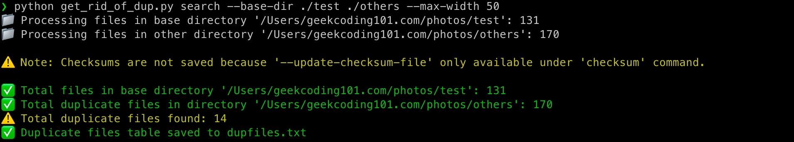
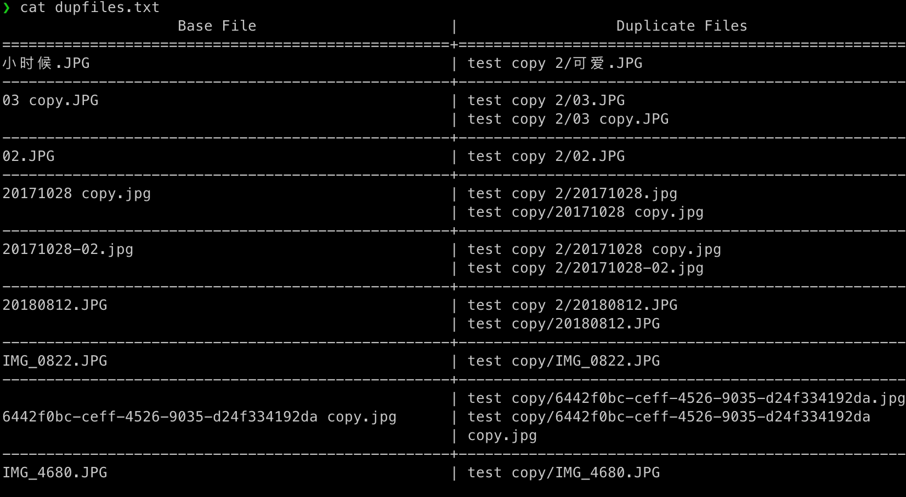
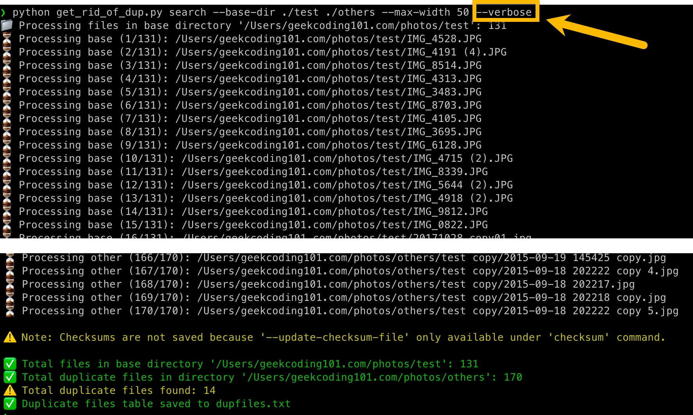
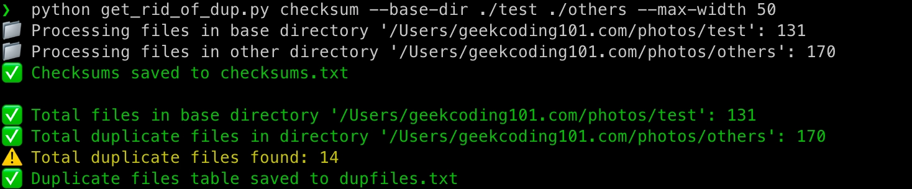
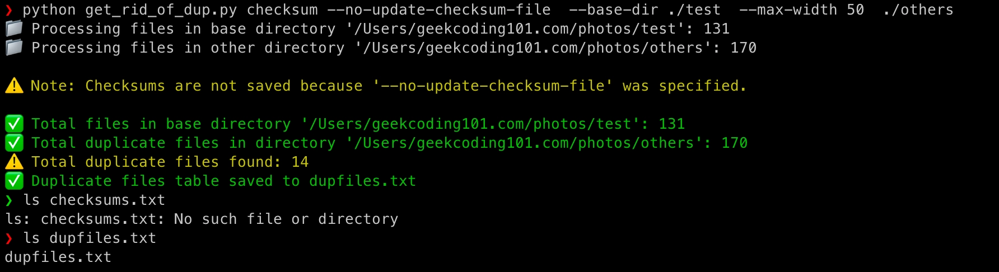
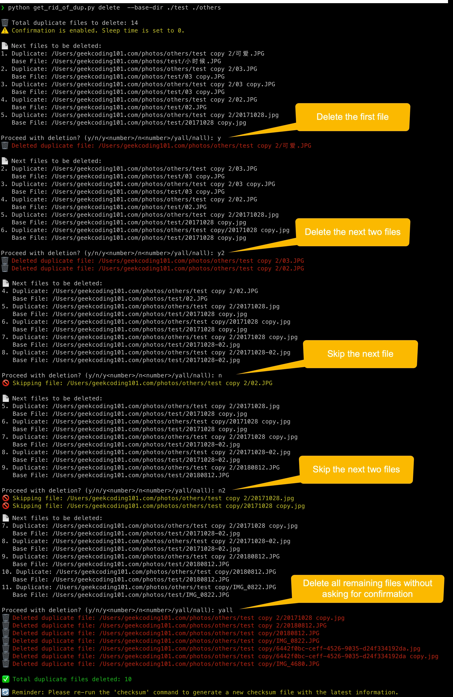
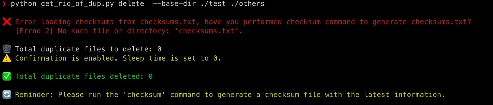

# 🗂️ get_rid_of_dup.py: Eliminate Duplicate Files with Ease!

`get_rid_of_dup.py` is a command-line tool designed to find and remove duplicate files efficiently using checksum comparisons. Whether you're searching, managing, or deleting duplicate files, this script has got you covered! 💾

---

## 🚀 Features
- **`search`**: Locate duplicate files without saving checksum information. This is usually for quick test.
- **`checksum`**: Everything in `search`, plus saving checksums into file. This is usually your first step.
- **`delete`**: Remove duplicate files based on checksum data, this. This is your last step.

---

## 📦 Installation
I am using `Python 3.12.6`, it should work for all `Python 3+` as long as the additional packages installed successfully.

Run the following command to install the dependencies:

```pip install xxhash termcolor texttable```


## 📜 Commands and Usage

### 🔍 `search` Command
Search for duplicate files by comparing against a base directory.

**Usage:**

```
python get_rid_of_dup.py search [options] <path>
```

**Options:**
- `<path>`: Path to search for duplicates (positional argument).
- `--base-dir`: Base directory containing original files (required).
- See [Common Arguments](#-common-arguments) below.

**Example:**

```
python get_rid_of_dup.py search --base-dir ./test ./others --max-width 50
```

---

### 🔑 `checksum` Command
Calculate checksums and optionally save them to a file while identifying duplicates.

**Usage:**

```
python get_rid_of_dup.py checksum [options] <path>
```

**Options:**
- `<path>`: Path to scan for duplicates (positional argument).
- `--update-checksum-file`: Update the checksum file with new entries.
- `--base-dir`: Base directory containing original files (required).
- See [Common Arguments](#-common-arguments) below.

**Example:**

```
python get_rid_of_dup.py checksum --no-update-checksum-file  --base-dir ./test  --max-width 50  ./others
```

---

### 🗑️ `delete` Command
Delete duplicate files using checksum information.

**Usage:**

```
python get_rid_of_dup.py delete [options] <path>
```

**Options:**
- `<path>`: Path to delete duplicates from (positional argument).
- `--sleep-time`: Time to wait between deletions (default: 1.0 seconds).
- `--confirm`: Enable confirmation before deletion.
- `--list-next`: Number of files to preview before confirmation (default: 5).
- See [Common Arguments](#-common-arguments) below.

**Example:**

```
python get_rid_of_dup.py delete  --base-dir ./test ./others
```

---

## ⚙️ Common Arguments
These arguments apply to all commands:

- `--base-dir`: **(Required)** Base directory containing original files.
- `--checksum-file`: File to save or read checksum data from (default: `checksums.txt`).
- `--skip-existing`: Skip checksum calculations for already-processed files. (default: False).
- `--no-skip-existing`: The opposite of `--skip-existing`.
- `--max-width`: Maximum column width for displaying results (default: 128).
- `--verbose`: Enable verbose output (default: False).
- `--no-verbose`: The opposite of `--verbose`.
- `--output-file`: Save duplicate files table to a file (default: dupfiles.txt).
- `--print-table`: Print the duplicate files table to the console (default: False).
- `--no-print-table`: The opposite of `--print-table`.

## Command-Specific Options:
- `checksum`: 
  - `--update-checksum-file`: Instruct to generate checksums file. Default filename is `checksums.txt`.
- `delete`: 
  - `--sleep-time`: Set delay between deletions (default: 1).
  - `--confirm`: Enable confirmation prompts (default: True).
  - `--no-confirm`: The opposite of `--confirm`
  - `--list-next`: Set number of files to preview before confirmation (default: 5).

---

## 💡 Examples
### Search for Duplicates Without Saving Checksums into File

```
python get_rid_of_dup.py search --base-dir ./test ./others --max-width 50
```



The duplicate files table:



```
python get_rid_of_dup.py search --base-dir ./test ./others --max-width 50 --verbose
```



### Search for Duplicates via Checksum and Save into File

```
python get_rid_of_dup.py checksum --base-dir ./test ./others --max-width 50
```




```
python get_rid_of_dup.py checksum --no-update-checksum-file --base-dir ./test ./others --max-width 50
```




### Delete Duplicates with Confirmation

```
python get_rid_of_dup.py delete  --base-dir ./test ./others
```



When missing checksums.txt:

```
python get_rid_of_dup.py delete  --base-dir ./test ./others
```




### Skip Existing Checksums with Verbose Output

```python get_rid_of_dup.py checksum --base-dir /path/to/base_dir --skip-existing --verbose /path/to/other_dir```

---

## 📝 Notes
- Always **back up your data** before deleting files.
- Use `--confirm` with `delete` to review files before removal.
- The `--skip-existing` option speeds up processing for large datasets.
- Enable `--verbose` for detailed progress logs.

---

## ❤️ Contribution & Support
Feel free to fork, contribute, or raise issues on GitHub! Suggestions, bug reports, and stars 🌟 are always welcome. Together, let's declutter your file system!

---
